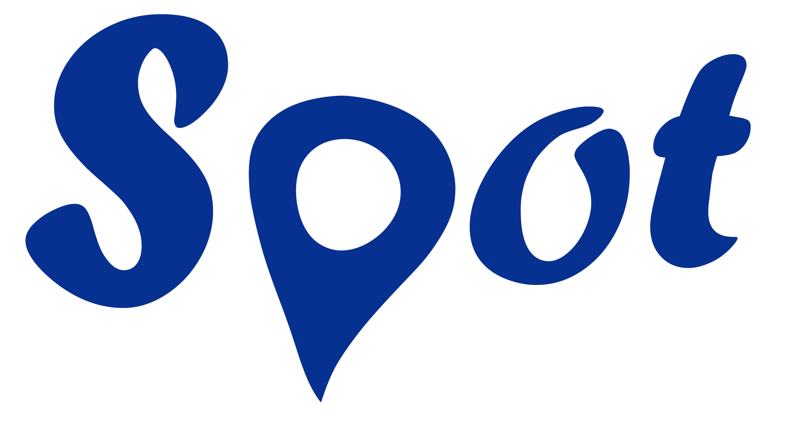
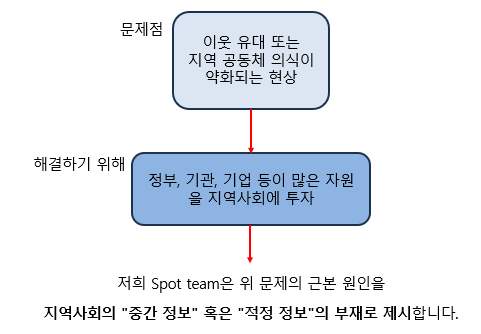
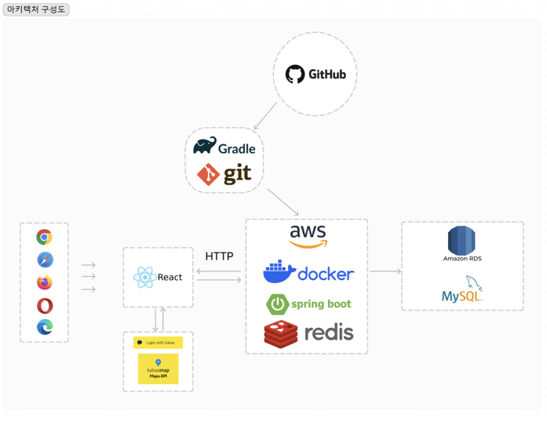
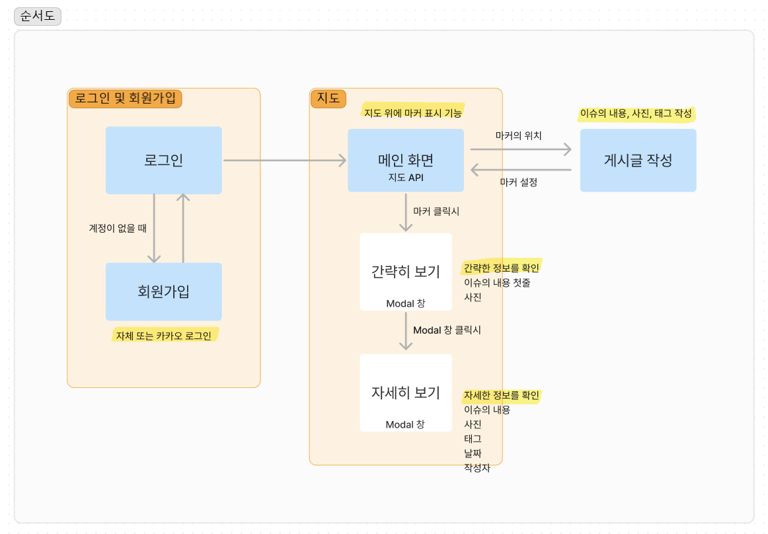

 
 
<head>
<link rel="preconnect" href="https://fonts.googleapis.com">
<link rel="preconnect" href="https://fonts.gstatic.com" crossorigin>
<link href="https://fonts.googleapis.com/css2?family=Nanum+Gothic+Coding&display=swap" rel="stylesheet">
</head>

  

<b><a href="https://www.notion.so/Spot-team-66ce6dfe5ec9402dbd00595cbab7b441">찍을수록 커지는 스팟</a></b> 
"지도 상에서 사용자가 발견한 동네 소식 및 이벤트를 마커로 찍어 실시간으로 공유하는 플랫폼"  
다량의 마커는 하나의 스팟이 되어 사용자에게 더욱 눈에 띄게 전달되며,  이를 통해 지역 사회의 소식을 신속하게 공유하고 활성화시키는 것이 목표입니다.

 
 

<h2>📌 개요 </h2>
<ul>
    <li>프로젝트 이름 : Spot  - 찍을수록 커지는 스팟 </li>
    <li>개발 기간 : 2023.11.24 ~ 2023.11.25</li> 
    <li>개발 엔진 및 언어: React & Spring Boot</li> 
    <li>개발팀 : Spot team</li>
    <li>🥈 2023 모배디 해커톤 경진대회 은상 수상</li>
</ul>

 
 

<h2>⚙ Stacks</h2>

<h4> Environment </h4>

<h4> Development </h4>

[//]: # (![]&#40;https://img.shields.io/badge/-?style=for-the-badge&logo=Strapi&logoColor=white&#41;)

[//]: # (![]&#40;https://img.shields.io/badge/-?style=for-the-badge&logo=Next.js&logoColor=white&#41;)

<h4> Communication </h4>

 
 

<h2>👯 Spot 팀 소개 </h2>

<table>
<tr>
    <th scope="col" colspan="3">Back</th>
    <th scope="col" colspan="1">Front</th>
    <th scope="col" colspan="1">PM</th>
</tr>
<tr align="center">
    <td>김남석</td>
    <td>민정윤</td>
    <td>홍준표</td>
    <td>이예슬</td>
    <td>이승현</td>
</tr>
<tr>
    <td></td>
    <td></td>
    <td></td>
    <td></td>
</tr>
<tr align="center">
    <td><a href="https://github.com/downfa11">@downfa11</a></td>
    <td><a href="https://github.com/YuneeeM">@YuneeeM</a></td>
    <td><a href="https://github.com/howudong">@howudong</a></td>
    <td><a href="https://github.com/mimpie">@mimpie</a></td>
</tr>
</table>

 
 

<h2>🤔 문제 정의</h2>

"적정 정보"는 지역 주민 참여로 생성되며, 리얼타임으로 제공되어 지역 공동체에 필요한 정보를 빠르게 전달하면서도 신뢰성과 다양성을 유지합니다.  이는 지역 공동체 내의 공통된 문제를 드러내어 지역 주민 간의 소통과 협력을 촉진하며, 지역사회 의식을 높이는 중요한 역할을 합니다.  
더불어, 적정 정보는 <strong>사회적 이슈</strong>뿐만 아니라 <strong>맛집, 여행, SNS</strong> 등 다양한 주제에 대한 정보와 시사점을 확장하여 제공합니다.

 
 

<h2>⚙️ 서비스 소개</h2>

<h5> ✔️ 부산에서 일어나는 다양한 이슈들을 지도에 마커를 찍어 공유하는 플랫폼 </h5>

<h5> ✔️ 부산 내의 다양한 이슈들을 지도를 통해 파악 가능 </h5>

<h5> ️️️✔️ 개인이 찍어 올린 이슈들을 효과적으로 관리하고 공유함 </h5>

<h5> ✔️ 일정이상의 마커는 스팟이 되어 눈에 띄게 전달 가능 </h5>

 
 

<h2>👀 핵심 기능 소개</h2>

<h5> ⭐ 로그인 및 회원가입 </h5>
<li>자체 및 카카오 로그인을 통해 사용자를 인증함</li>

<h5> ⭐ 메인화면 - 지도 API </h5>
<li>부산의 다양한 이슈를 지도와 그 위의 마커를 찍어 시각적으로 확인할 수 있음</li>

<h5> ⭐ 게시글 </h5>
<li>메인화면에서 사용자 지정 마커의 위치, 메인 작성 화면에서 사진, 태그 등을 포함함</li>
<li>마커를 클릭하면 이슈의 내용, 사진, 태그, 날짜, 작성자 등 자세한 정보 확인이 가능함</li>
<li>게시된 이슈는 일정 시간이 지나면 메인 지도에서는 자동으로 사라짐</li>

<h5> ⭐ 정렬 및 검색 </h5>
<li>이슈를 주제 별로 태그하여 정렬 가능</li>

<h5> ⭐ 스팟(SPOT) </h5>
<li>일정 수 이상의 마커가 밀집될 때, 더욱 큰 마커가 생성되어 하나의 스팟이 됨</li>
<li>핵심❗ 지도 스케일에 따라 스팟의 분포가 K-means 알고리즘에 의해 군집 정도가 달라짐</li>

 
 

<h2>🔎 아키텍쳐</h2>

 
 

<h2>🛠 Flow Chart</h2>

 
 

<h2> ️️🖥️ 활동 주소</h2>

> **notion 주소** : [https://www.notion.so/Spot-team-66ce6dfe5ec9402dbd00595cbab7b441]()  
> **프론트 github** : [https://github.com/UMC-PKNU-Hackathon/F-Spot-Frontend]()  
> **백엔드 github** : [https://github.com/UMC-PKNU-Hackathon/F-Spot-Backend]()  

 
